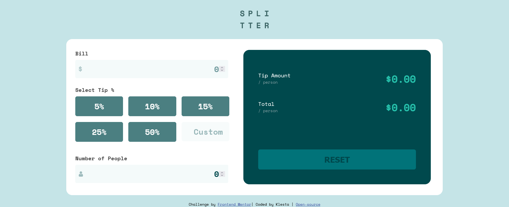

# Frontend Mentor - Tip calculator app solution

This is a solution to the [Tip calculator app challenge on Frontend Mentor](https://www.frontendmentor.io/challenges/tip-calculator-app-ugJNGbJUX). 

## Table of contents

- [Overview](#overview)
  - [The challenge](#the-challenge)
  - [Screenshot](#screenshot)
  - [Links](#links)
- [My process](#my-process)
  - [Built with](#built-with)
  - [What I learned](#what-i-learned)
  - [Continued development](#continued-development)
- [Author](#author)

## Overview

### The challenge

Users should be able to:

- View the optimal layout for the app depending on their device's screen size
- See hover states for all interactive elements on the page
- Calculate the correct tip and total cost of the bill per person

### Screenshot

### Links

- Solution URL: (https://www.frontendmentor.io/solutions/responsive-tip-calculator-app-with-javascript-BJN0h69Q5)
- Live Site URL: (https://ecstatic-pare-cf6d58.netlify.app/)

## My process

### Built with

- HTML
- CSS
- Flexbox
- CSS Grid
- Mobile-first responsive workflow
- Vanilla JavaScript

### What I learned

I learned to add an event listener to multiple buttons. I also learned how to check for validity of number input, for example as in this case, to only allow whole, positive numbers in the number of people input. I also learned how to reset the app by refreshing the page instead of resetting everything manually.

### Continued development

Fix a bug where you can only click one tip button at a time.

For now, I set manual reset on three inputs as a page refresh didn't work in Firefox like it worked in Chrome. I'd like to learn how to reset the page by refreshing it in Firefox.

## Author

- Website - (https://www.klesdev.com/)
- Frontend Mentor - [@klezi10](https://www.frontendmentor.io/profile/klezi10)